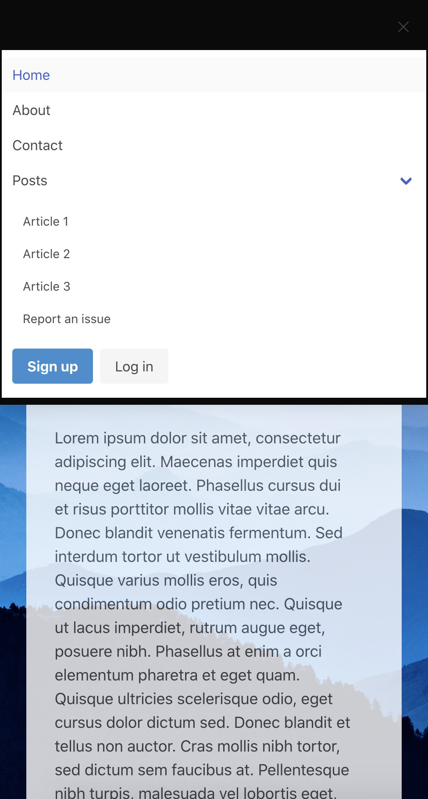

# Parallax Site
A simple landing page that utilizes a parallax effect.

## Description

I created this simple webpage as a template to try out a few CSS techniques that I have been interested in trying to implement. The webpage currently contains placeholder content, and I could see it being used for a blog. This site has a parallax effect on the background to keep the image in a fixed position while scrolling. It also has a sticky navbar, as well as several components from Bulma, a CSS framework.

I really appreciated the opportunity to work with a new CSS framework as I designed this page. Most of the sites I have created have utilized Bootstrap in some way, so I was excited for the opportunity to learn about a new tool. Bulma certainly has some unique features I haven't seen before, and I'm excited to use it in other projects as well. Between using Bulma and custom CSS for this site, I didn't run into many issues and felt that Bulma made designing the UI pretty straightforward.

Overall, creating this site was very helpful for me, and I am confident that I will use what I have learned in other projects as well. I'm proud of how polished this site looks.

A few ideas for future development include:

- Turning the site into a blog with additional pages
- Using React to turn the site into a fully functional SPA
- Continuing to try out and customize Bulma components

## Technologies Used

- HTML5
- CSS3
- Bulma

## Table of Contents

- [Installation](#Installation)
- [Usage](#Usage)
- [License](#License)
- [Contributing](#Contributing)
- [Tests](#Tests)
- [Questions](#Questions)
            
## Installation

The application can be viewed live on GitHub Pages here: https://vruss14.github.io/parallax/

Alternatively, the application can be cloned and run locally.

A view of the home page:

A view on mobile (with the hamburger nav open):

## Usage

This website is meant to demonstrate a few CSS techniques that enhance the user experience.

## License

This project has not yet been licensed, and thus, standard copyright laws apply.
            
## Contributing

Valerie Russell is the sole contributor to this project. 
            
## Tests

There are currently no tests written for this project.

## Acknowledgements

The background photo was taken by Sergey Pesterev and is available on Unsplash.
            
## Questions

If you have any questions about this application my GitHub username is vruss14 and you can view my GitHub profile at https://github.com/vruss14.

If you have additional questions, feel free to reach out to me at vruss14@gmail.com.

